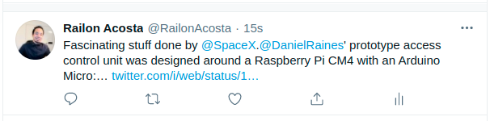

# ruby-template

This project is Microverse Ruby Capstone project. I have built a bot that posts a tweet at 12pm every day. I have selected three pages that interest me and my bot will retweet one of the recent 10 posts out of these three pages. It will also check its memory to confirm that it does not retweet the same tweet. 

 
## Built With

- RUBY
- Ruby Twitter Gem
- RSpec
- Visual Code

## Getting Started

To get a local copy up and running follow these simple steps.

### Prerequisites

- Terminal
- Ruby [Install](https://www.theodinproject.com/courses/ruby-programming/lessons/installing-ruby-ruby-programming)
- RSpec [Install](https://www.theodinproject.com/courses/ruby-programming/lessons/introduction-to-rspec)
- An account on Twitter with a Developer Portal
[WebPAge](https://developer.twitter.com/en)

#### Setup
- Run `bundle install` to install the required gems on your computer

#### Clone the repository
- Click on the "code" button above on this page and copy the link to the repository
- Open a terminal (CTRL + ALT + T), type `git clone` and paste the link you copied in the previous step, then hit Enter
Ex: ‘git clone https://github.com/RailonA/Twitter-bot.git’
- Go to the cloned repository using `cd` command
###Getting Your API Keys

After setting up your Twitter Developer Portal, you will need to make a new App.

On the top-left side select the arrow pointing down
Select the Overview 
Select `+Add App`

After Making an app, you should see `Settings` and `Keys and Tokens`
Select `Keys and Tokens`

You should now see Consumer Keys, please select `Regenerate`  for the `API key & secret` as well as the `Access token & secret`

Use these credentials to fill out :

config.consumer_key = "YOUR_CONSUMER_KEY"
config.consumer_secret = "YOUR_CONSUMER_SECRET"
config.access_token = "YOUR_ACCESS_TOKEN"
config.access_token_secret = "YOUR_ACCESS_SECRET"

### Run tests

From the root folder, run `ruby bin/bot.rb`

You should see something similar to
 
‘Fascinating stuff done by @SpaceXRT @nettofarah: For some reason, Rails + PostgreSQL + Plain CSS + Heroku still beats every single “modern stack” for web app develop… https://t.co/DQmHieWRfZ’

## Change NEEDED for the project to push to your Twitter Page
### Step: 1
For the code to push the content to your Twitter page, you must go to the ‘lib/tweet_methods.rb‘ file and uncomment line 41 by highlighting the line and pressing  (CTRL + ?)
‘@twitter.update("Fascinating stuff done by @#{@option_data_name[@randome_page]}" + selected_tweet)’
We can now delete line 40
‘   puts "Fascinating stuff done by @#{@option_data_name[set_randome_page]}" + selected_tweet’

### Step: 2
Run the program again by typing run `ruby bin/bot.rb`

You will now see a new Tweet on your Twitter account.

## Authors

👤 **Railon Acosta**
- GitHub: [@railonA](https://github.com/RailonA)
- Linkedin: [@railonAcosta](https://www.linkedin.com/in/railon-acosta-81265180/)
- Twitter: [@railonAcosta](https://twitter.com/RailonAcosta)

## 🤝 Contributing

Contributions, issues, and feature requests are welcome!

Feel free to check the [issues page](https://github.com/RailonA/Twitter-bot/issues).

## Show your support

Give a ⭐️ if you like this project!

## Acknowledgments

Thanks to both parties involved in the development of this project.

